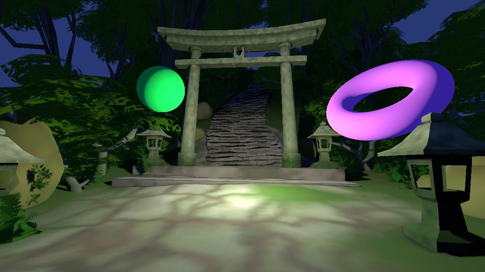
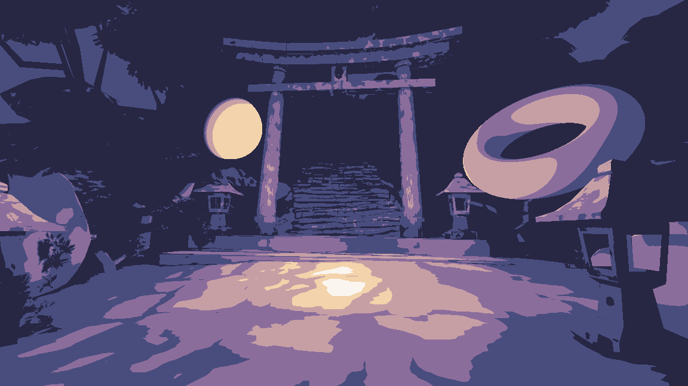
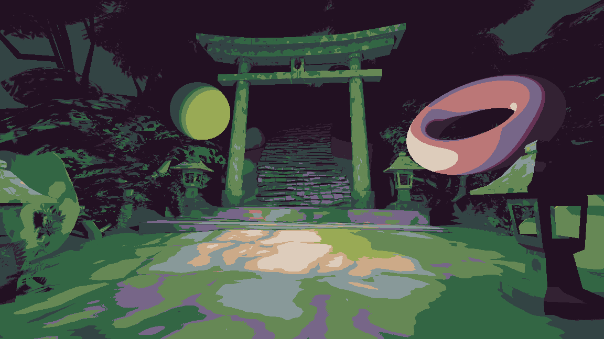
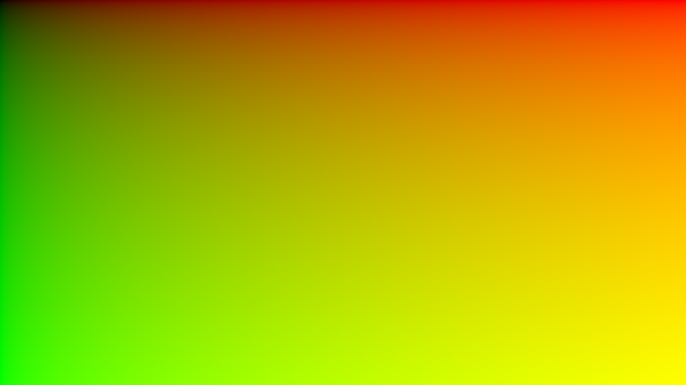
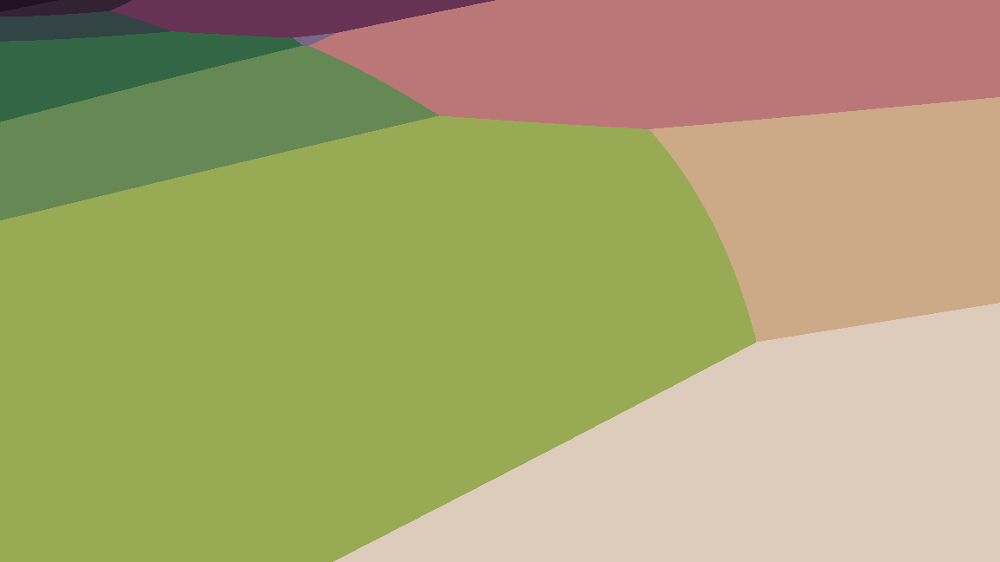
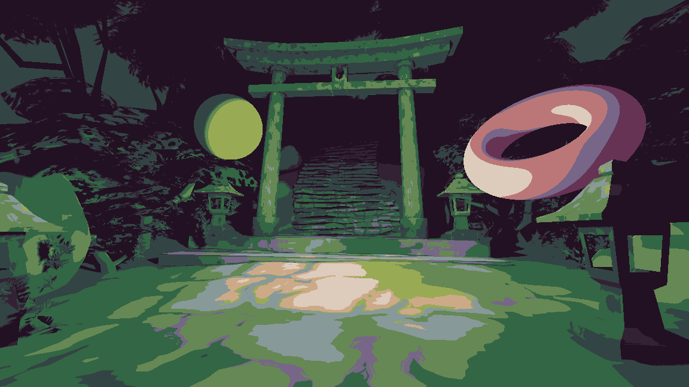

# Posterizer addon

Godot addon to snap colors to a pallete.

## Quick start
Install this addon either in the AssetLib or under the github releases. The addon should be in the `addons/posterizer` folder in your project.

- **"I just want to quickly see how my pallete will look/My color pallete is very small(<16colors)"**:
	1. Import your color pallete **as an `image`**(default import is `texture2d` and might not work).
	2. Use `posterizer_slow_fullres(_canvas).gdshader` with the image and a standart godot post process shader setup.

- **"My color pallete is big/I want maximal performance"**:
	1. In the center bottom dock find the "PosterizerLutGenerator" tab and generate LUT for your color pallete.
	2. Use `posterizer_lut(_canvas).gdshader` with the generated LUT and standart godot post process shader setup.

- **"I want to use posterization functions inside of my shader"**:
	- Just include `posterizer_funcs.gdshaderinc` and use the function you need. Be sure to look at them to know what color space to use. Helper methods for color space transitions can be found in `posterizer_color_conversion_helpers.gdshaderinc`

## Gallery 
| Before | Color palette | After |
| :---: | :---: | :---: |
|  |  |  |
|  |  |  |

## Example project
You can pull this project and test out an example scene under the `project/examples/` folder.

## Troubleshoot/FAQ: 
- **Error/Crash when generating LUT**:
	- try switching to a gdscript generator, which is much slower, but will work. Go to the `addons/posterizer/src/lut_generator_ui.gd` and modify lines 52 and 62 to use generatorGDScript variable.
- **My pallete colors look all wrong**: 
	- if you are using fullres version, the pallete might be imported as a `Texture2D`. Go to the import settings in the top left and change it to `Image`. If that is correct, double check color spaces. Fullres function expects linear color and SRGB pallete as input and outputs pallete color space. Lut function expect linear color as input and doesnt care about the LUT, returns in the same space as LUT.
- **Scene takes ages to start up**:
	- You are potentially using too large of a LUT, luts above 128 are not recommended, 64 or 32 should be enough for most applications.

## What is LUT and what is the difference from Fullres:
LUT is a lookup table which maps all colorspace to the pallete. Size of LUT is on how big of a blocks to subdivide the colorspace, ie. LUT of size 64 will subdividt RGB colorspace 8x8x8 blocks, so you will take your RGB color and find closest pallete color for that 8x8x8 block.

LUT is fast and works on arbitrairly large color palletes in O(1) time. Fullres iterates over all color pallete for each pixel and can get expensive fast. There is little practical difference in the resulting image quality. To see what LUT is doing, here are some comparisons:
| Original Image | 64 LUT Shader | Fullres Shader |
| :---: | :---: | :---: |
|  |  |  |
|  |  |  |

## Limitations
- "3d post process" effect, the one not using the canvas, doesn't work with transparency. I did not want to overengineer for the test scene. If you need transparency there are 2 methods you can use:
	- Compositor effects. One repo for example: https://github.com/thompsop1sou/custom-screen-buffers
	- Viewport screen buffers. Example: https://github.com/thompsop1sou/custom-screen-buffers
- Because LUT expects values in the 0.0-1.0 range the HDR range might not be reflected as accurately as in the fullres shader. I preserve specular highlights with `remap_hdr` I wrote, it moves hue closer to white, but preserves specular highlights. `blowout_power` parameter can be tweaked so the effects look good with your specific pallete. If you absolutely want fully accurate specular highlight, but fullres is too slow, then you can write a gdscript to precalculate your palette image into OKLAB color space, check the gdscript lut generator code for conversion functions. This will save on some processing power, since you wont need to convert every pixel in the color palette into OKLAB.
- Code turned out not to be so beginner friendly, everything is all over the place :p.
- I think palletizer is a more appropriate name. Posterizer might imply automatic palette creation. Well I'm not renaming stuff because im lazy.
## Credits
Code by me, 508312

Color palletes used in the example scene are:
- side-forest-1x-pallete.png - https://lospec.com/palette-list/side-forest by Cactus Celery.
- oil-6-1x.png - https://lospec.com/palette-list/oil-6 by GrafxKid.

Scene used in the example scene:
- "Japanese forest" (https://sketchfab.com/3d-models/japanese-forest-2454c5c1e37941d6904a1ccb1e0ec154) by Jesus aponza (https://sketchfab.com/Jesusaponza) licensed under CC-BY-4.0 (http://creativecommons.org/licenses/by/4.0/)

## License
Distributed under the MIT License. See `license.md` for more information.
